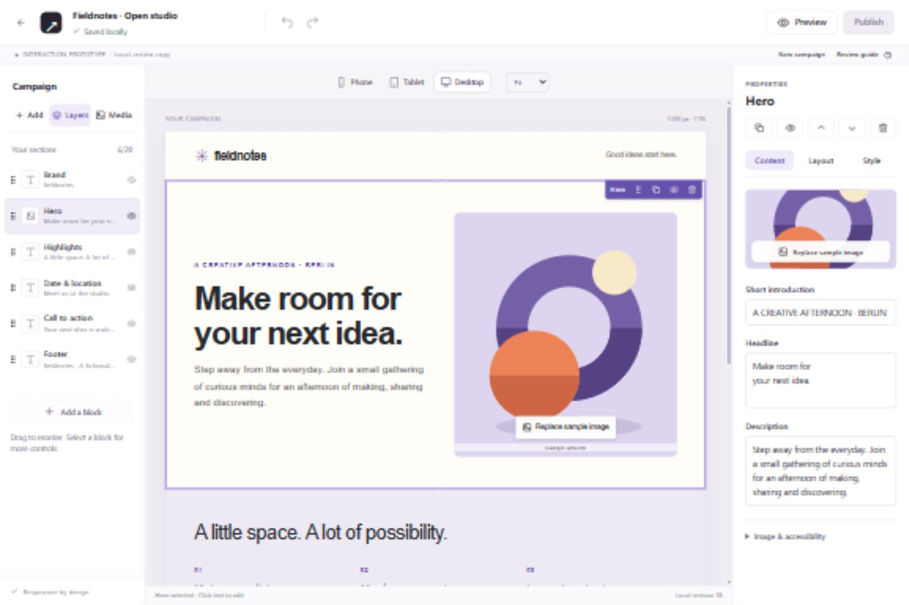
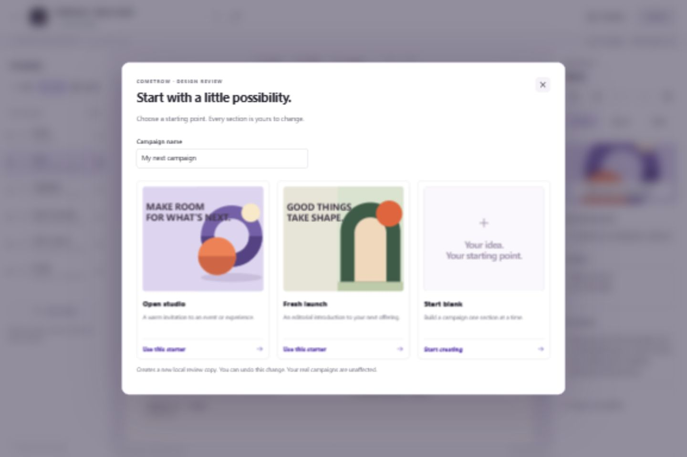
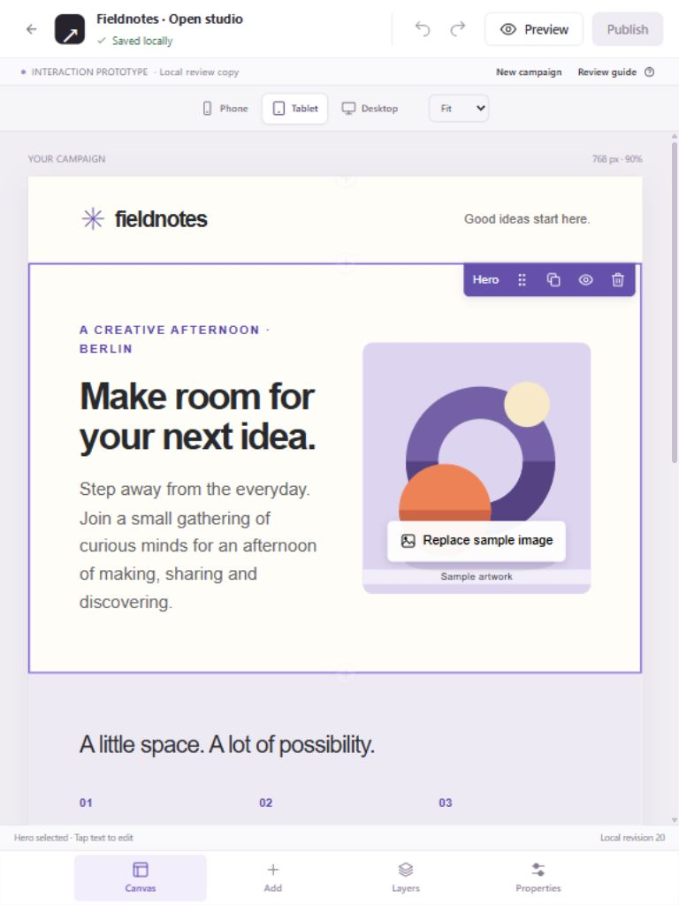
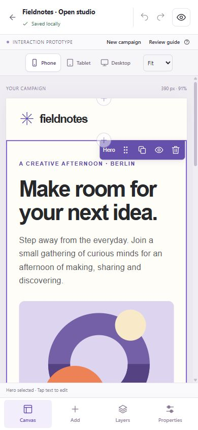
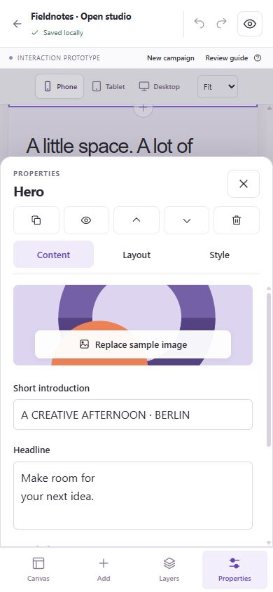
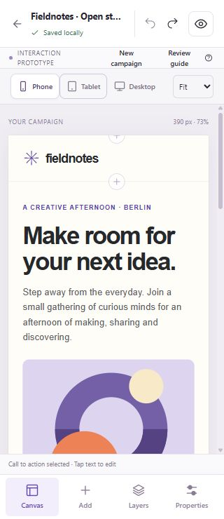

# Founder review: visual campaign editor prototype

This review approves an **interaction design only**. Phase 2 is not accepted. The existing production editor has not been replaced, and Phase 3 has not started.

## Open the prototype

From `C:\Gyanesh\Startups\CometRow`:

```powershell
npx.cmd tsx scripts/editor-prototype.ts
```

Open http://127.0.0.1:3001. No account or password is required. Keep that terminal running. The real application remains on port 3000 and still starts with `npm.cmd run setup`.

The review browser saves one local copy under this separate origin. “Saved locally” never means that a production campaign was updated. Reload reopens that copy; Undo history lasts for the current session. Closing the tab before saving or clearing browser data may discard the review copy. Use **Review guide → Download review copy** for a JSON snapshot; an import UI is not included.

## Ten-step design review

1. Click **New campaign**. Enter a name. Review the two starters, then choose **Start blank**.
2. In **Add**, search for **Hero** and click its thumbnail. The Hero appears on the canvas and becomes selected.
3. Click the headline **on the canvas** and type your own. Click outside it. The inspector displays the same text. Wait for **Saved locally**.
4. Click **Replace sample image** on the canvas or in Properties. Choose **Arch** or **Wave**. The artwork changes. These are bundled vector samples, not uploaded images.
5. Choose **Layout → Centered**, then **Style → Soft** and another campaign accent. The section and all relevant campaign accents update immediately.
6. In **Add**, search for **Call to action** and add it. It goes below the selected Hero. Select its text on the canvas or edit it in Properties.
7. Open **Layers**. Drag the Call to action handle above Hero. Check the insertion line and the changed canvas order. Alternatively select it and use the labelled Move up/down inspector buttons, or Alt+Arrow on its handle.
8. Click **Undo**, then **Redo**. Check both the Layers order and canvas. Wait for **Saved locally** again.
9. Try **Phone**, **Tablet** and **Desktop**, then **Preview**. It is one responsive document. Preview hides editing controls and hidden sections. **Back to editor** returns to the same draft.
10. Open **New campaign** again and choose **Open studio** with the name `Fieldnotes · Open studio`. Review the richer composition. A starter is an ordinary set of editable blocks. This replaces only the local prototype copy and is undoable.

On phone/tablet, use the bottom **Add**, **Layers** and **Properties** sheets. Close a sheet to return to the canvas. Direct inline editing also works on the mobile canvas; full-size inspector fields are available when typing in context is inconvenient.

## Additional interaction checks

- Drag a block from the library onto the canvas, placing it between existing sections. Or use a between-section plus control to select an insertion point before choosing a block.
- Duplicate, hide/show and delete a selected section. Undo restores a deletion. In Preview, hidden sections are absent. The 20-block limit still applies.
- Search for a nonexistent block; clear the empty result. Filter by a category. All twelve approved block types remain available.
- Use a syntactically valid nonexistent HTTPS link: it may save. Unsafe protocols and malformed URLs block saving and show feedback. Destination existence is not checked.
- Open **Review guide → Simulate next save failure**, edit a field, and wait. A visible failure and Retry action must appear without losing the text. Retry saves locally.
- **Review guide → Try read-only mode** disables mutations and renders a non-editable canvas. Return through the same guide. This demonstrates the interaction; real permissions remain the production server's responsibility.
- Tab through the editor and mobile sheet. Escape closes a sheet/dialog or exits preview. Native dialogs manage focus; the mobile sheet limits Tab navigation to its controls and bottom navigation.

## Local prototype conflict exercise

Open port 3001 in two browser tabs before editing. Both must show the same local revision in the canvas footer (use desktop width). Rename the review campaign in A and wait for Saved locally. Without reloading B, change its name or a block. B must show a conflict and **Review versions**. Compare, download your copy, then explicitly choose a version. A further save from A before B chooses Keep my version must produce another conflict in B.

This is a sequential local-storage simulation, not a production concurrency guarantee. Production keeps the existing database transaction, mutation-ID and revision checks; its already-tested stale-write procedure remains in `PHASE_2_REVIEW.md`.

Verified in the browser: both review tabs loaded local revision 18, A saved 19, B displayed a conflict against 19, and choosing the saved version completed successfully. The sample name and content were restored afterward.

## What to approve

Review the canvas-first workflow, inline editing, insertion/drag behavior, starter choice, contextual inspector and mobile sheets. Approve these interactions or identify specific changes. Approval permits the planned editor implementation discussion; it does not accept Phase 2 or authorize Phase 3.

Per-section layout/tone/spacing require a separately approved versioned schema design. Sample artwork, the local save simulator and review-only controls will not be copied into production as backend behavior.

## Screenshots

Actual browser captures, not mockups:

### Desktop · 1440 × 960



### Starter chooser · desktop



### Tablet · 768 × 1024



### Mobile · 390 × 844





### Narrow viewport · 320 × 740



## Verification and limits

- Prototype model checks: 4 pass. Covers every starter/block against the existing schema; immutable reorder; compound undo/redo; escaped rendering and preview removal of editing/hidden content.
- Prototype strict TypeScript and ESLint checks pass.
- Full application `npm run check` passes: 18 unit tests, 34 PostgreSQL integration scenarios (35 runner entries including the parent), typecheck, lint, formatting and production build. Existing production source and database migrations were not modified.
- Browser exercised blank creation, library search, Hero inline editing, sample replacement, layout/color, CTA insertion, actual pointer layer reorder on desktop/mobile-sized viewports, library-to-canvas drag, undo/redo, three preview widths, failure/retry, mobile sheets and keyboard Tab navigation. 320px and 768px document widths showed no horizontal overflow.
- Tests use local Chromium. Physical touch, Safari/Firefox, full screen-reader/IME coverage and production-grade undo/caret edge cases require the implementation acceptance pass. Local-storage saves are demonstrative and do not offer production-grade simultaneous cross-tab transactions. Layout/media appearance is prototype-only. The back link returns to the existing application rather than a prototype campaign overview.

See [the audit](CAMPAIGN_EDITOR_UX_AUDIT.md), [interaction specification](CAMPAIGN_EDITOR_SPEC.md), [traceability checklist](CAMPAIGN_EDITOR_TRACEABILITY.md) and [preservation plan](CAMPAIGN_EDITOR_IMPLEMENTATION_PLAN.md).
