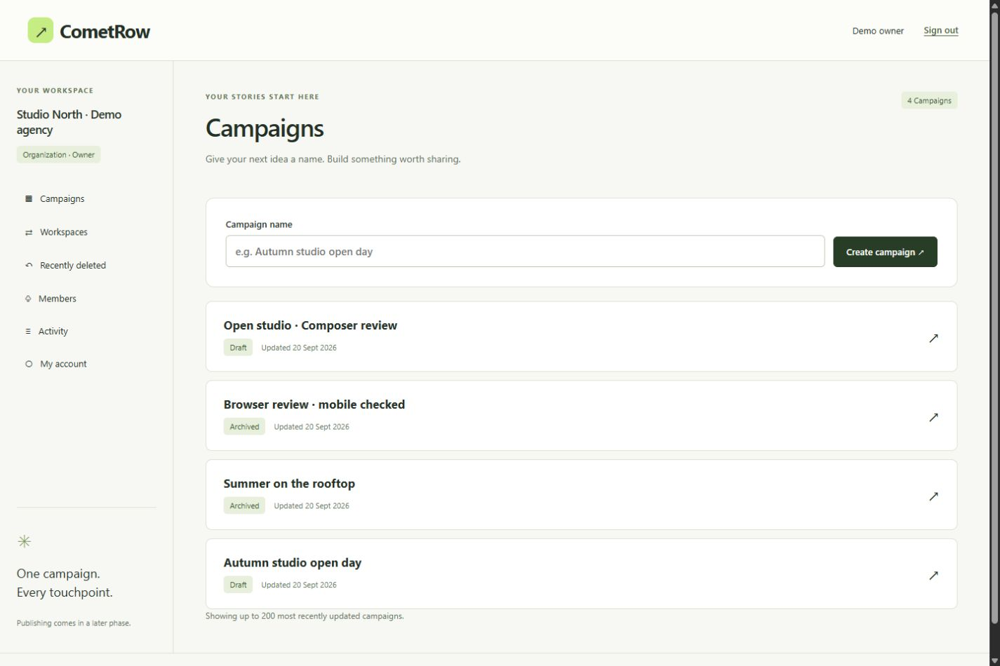
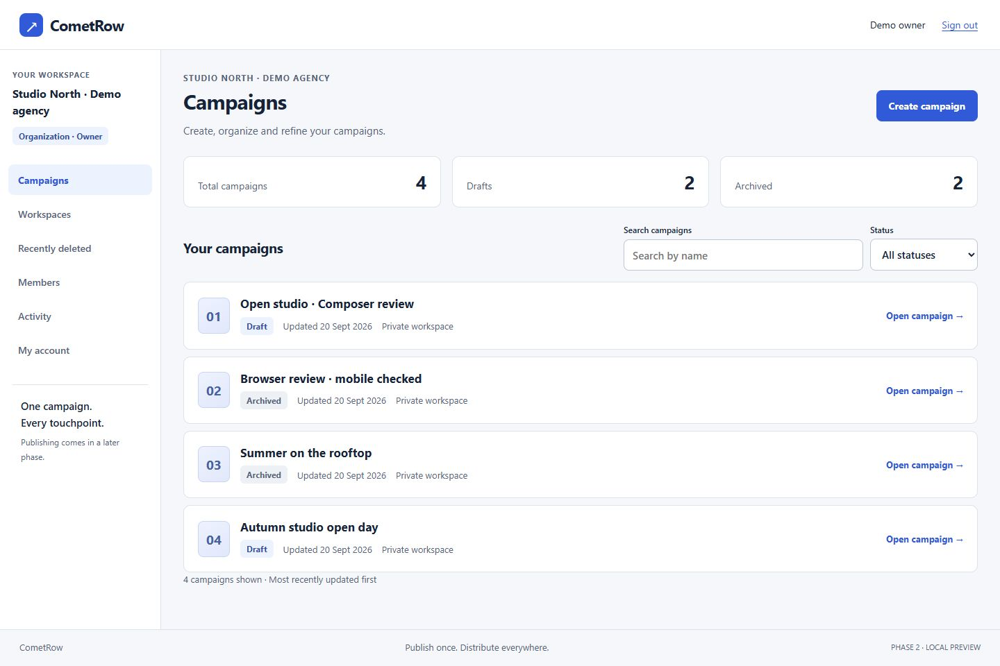
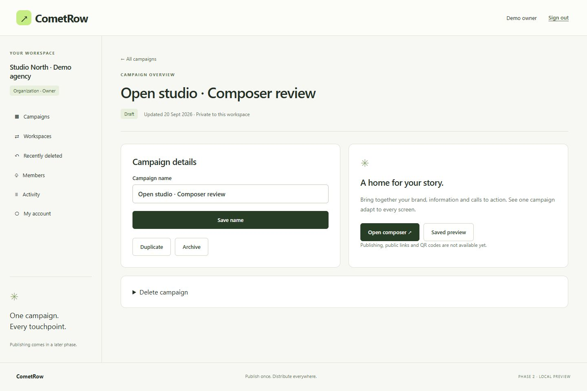
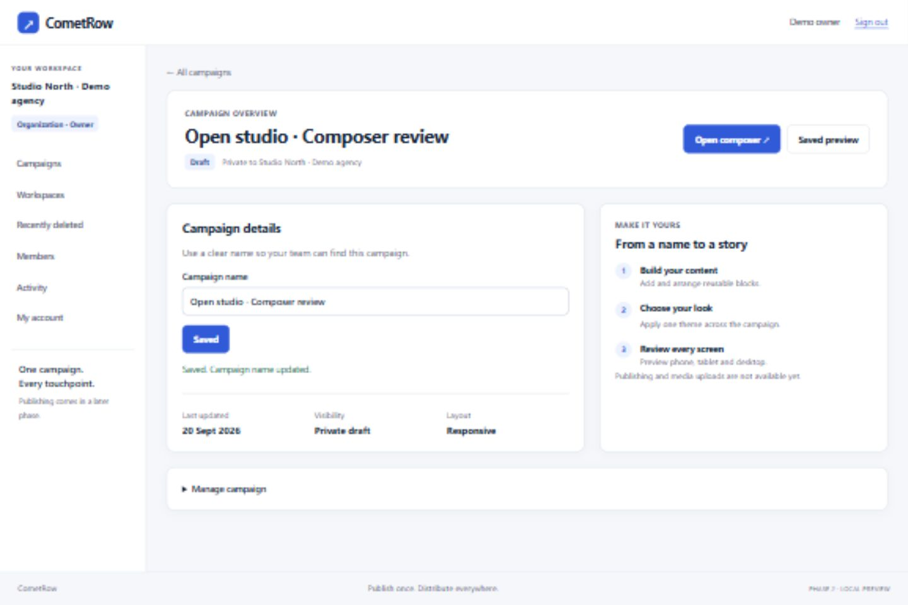
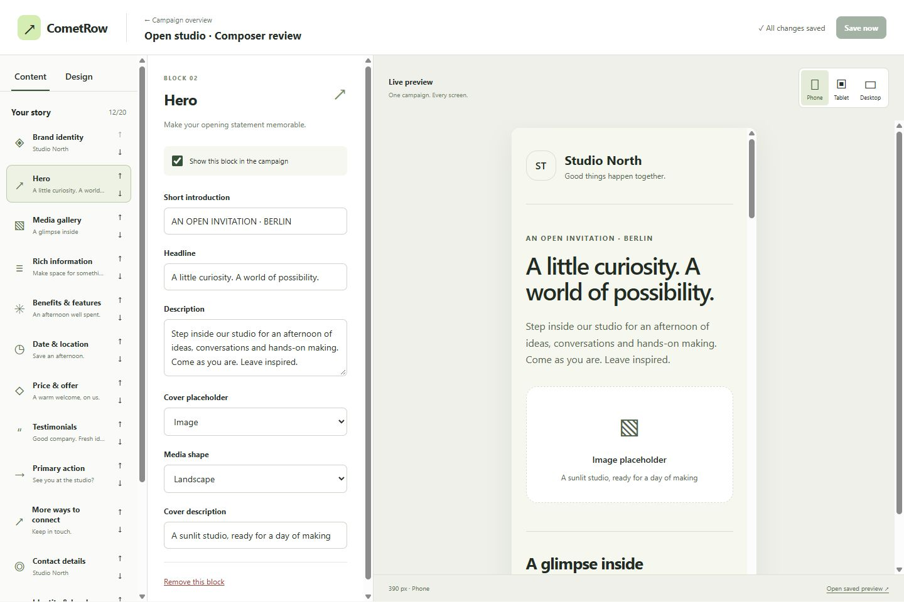
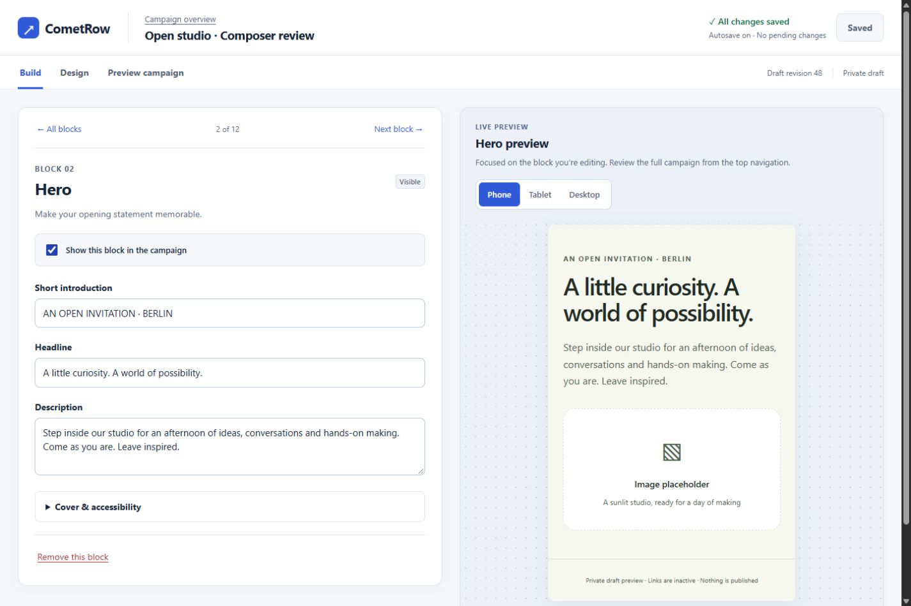
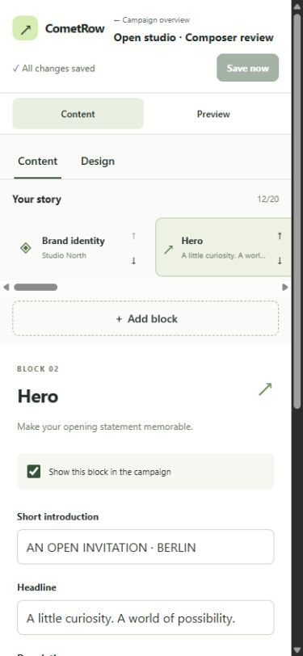
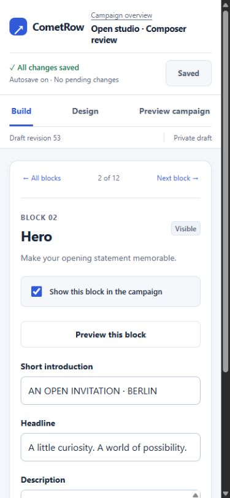
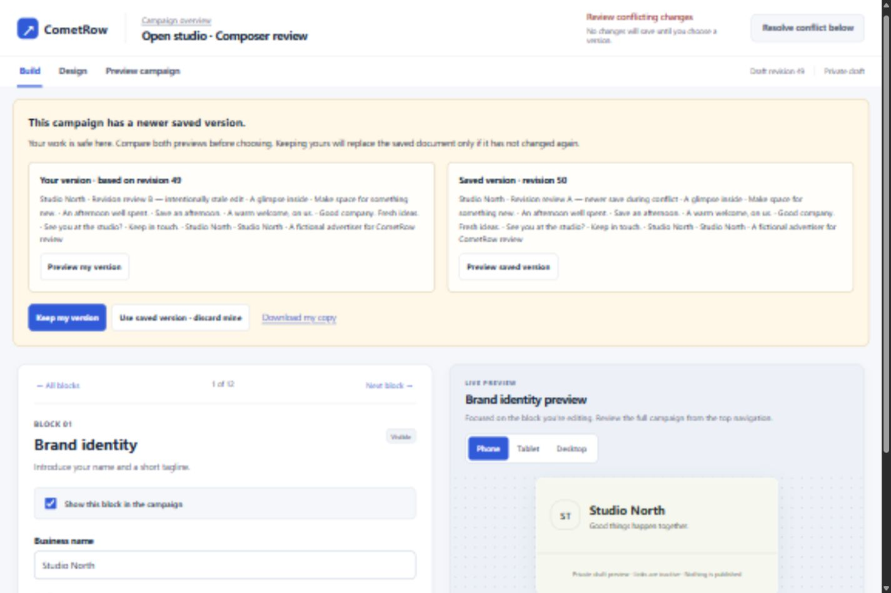
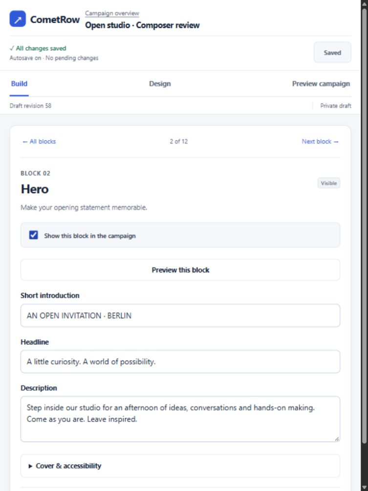

# Phase 2 UX revision — visual review

Phase 2 remains unaccepted; Phase 3 has not started. These are unretouched browser captures from the same local sample campaign. Desktop uses 1440×960; mobile uses 390×844. Review full images to assess typography and spacing. Minor sample text/revision changes reflect functional testing.

The redesign replaces the three independently scrolling composer panels with a block-card overview, focused editing with a contextual preview, and a full-campaign preview. On mobile, block selection and editing are separate views, with explicit navigation back to the structure. Shared design tokens unify the dashboard and builder. Functional checks include name confirmation/errors, autosave states, URL syntax-only validation and stale-revision conflicts.

## Dashboard

Before:

After:

## Campaign overview

Before:

After:

## Desktop composer

Before:

After:

## Mobile composer

Before:

After:

## Verified conflict

B first conflicted with A, then its resolution based on revision 49 conflicted again after A saved revision 50. The latter alert is captured below; the newer content remained intact.

## Tablet

See [PHASE_2_REVIEW.md](PHASE_2_REVIEW.md) for the exact reproduction procedure and [STATUS.md](STATUS.md) for verification scope.
