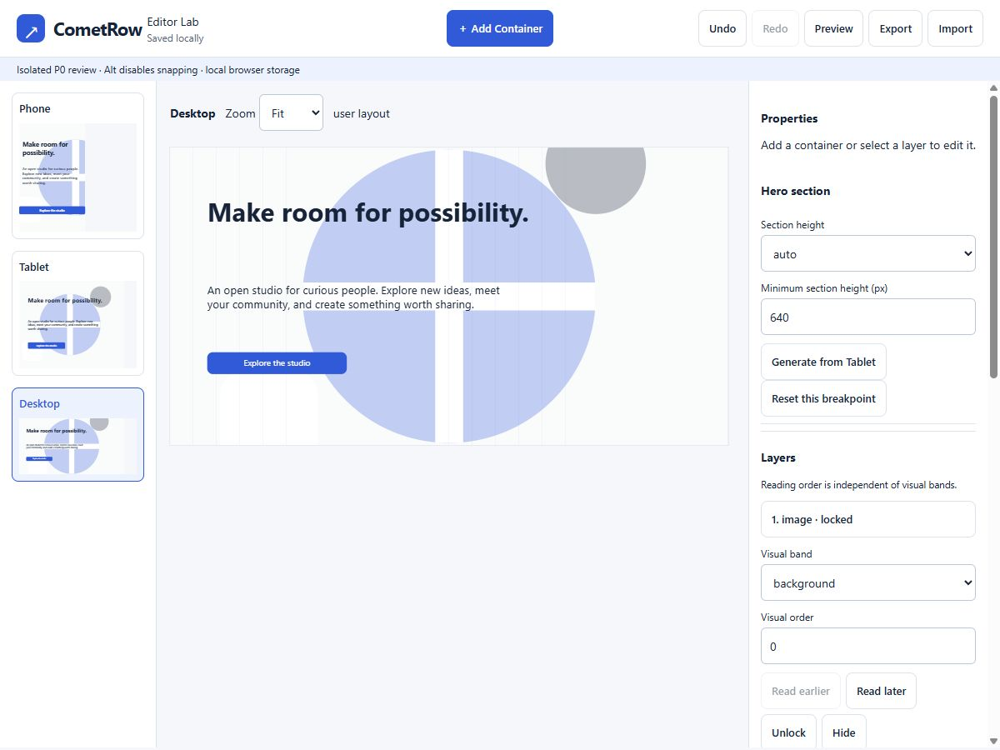
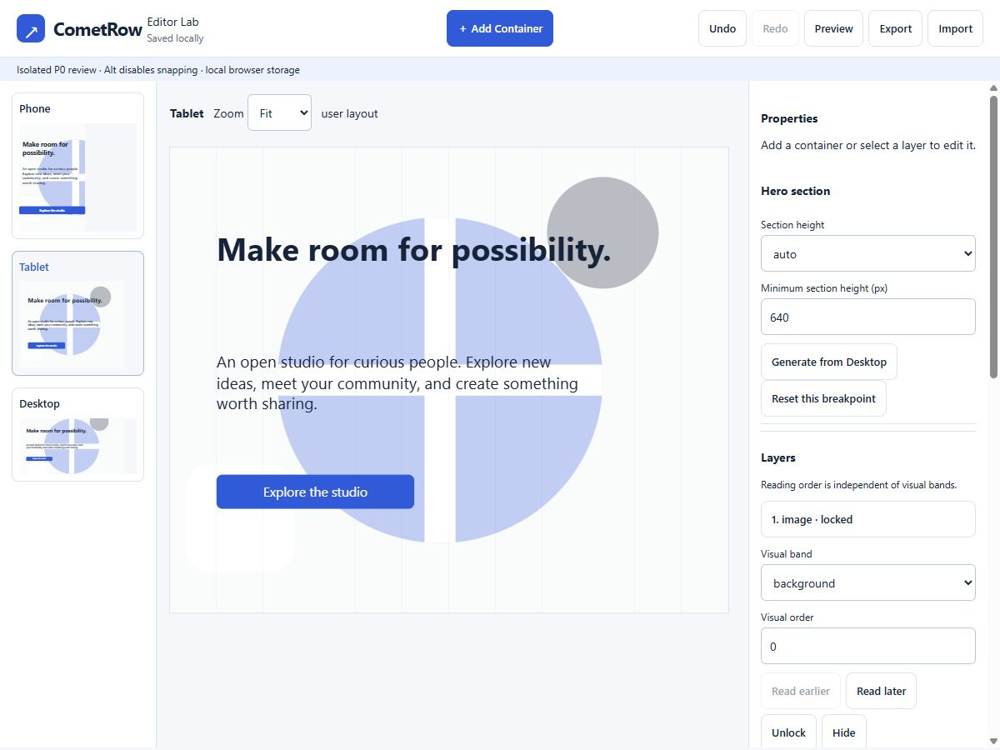
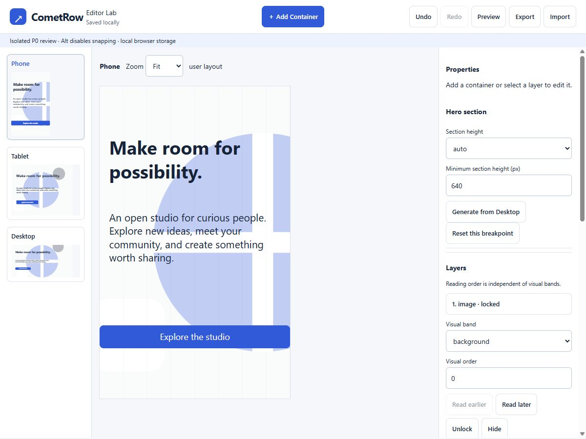

# CometRow Editor Lab — founder review handoff

Status: isolated prototype ready for founder review. This is not production acceptance or authorization for integration. Phase 2 remains unaccepted.

## Start and review

From `C:\Gyanesh\Startups\CometRow`, run:

```powershell
npm run editor:lab
```

Open <http://127.0.0.1:3002/editor-lab>.

The existing P0 server remains the host on loopback port 3002. The original P0 surface at `/` is preserved. The old port-3001 prototype was not started. The production server, editor, routes, schema and persistence were not modified or migrated.

Browser acceptance runner: <http://127.0.0.1:3002/editor-lab/tests>. Opening this route runs the tests automatically, using a separate IndexedDB test database for each run. It does not replace the founder's lab draft.

## Changed files

Modified:

- `package.json` — Editor Lab start, unit-test and strict-typecheck scripts; pinned AJV development dependency.
- `package-lock.json` — corresponding dependency declaration.
- `.prettierignore` — preserve the founder-authored build specification and JSON Schema verbatim; their original formatting failed the repository formatter.
- `scripts/editor-p0.ts` — add Editor Lab and browser-test routes/assets to the existing isolated server.

Added under `docs/prototypes/editor-p0/`:

- `lab-model.ts` — contract types, exact supplied JSON Schema integration, integrity/security validation, seed, geometry and snapping.
- `lab-commands.ts` — typed mutations, independent maps, generation protection, history.
- `lab-render.ts` — shared semantic DOM renderer, live measurements and warnings.
- `lab-storage.ts` — isolated IndexedDB document/blob storage and corruption recovery.
- `lab-app.ts` — shell, preview rail, picker, pointer gestures, inspector, layers, confirmation dialogs and JSON transfer.
- `lab.html`
- `lab.css`
- `lab-sample.svg` — reuses the existing P0 studio artwork.
- `lab-sample.webm` — bundled two-second synthetic studio-color video, generated locally.
- `tsconfig.lab.json` — strict checking for the prototype modules.
- `lab-model.test.ts`
- `lab-commands.test.ts`
- `lab-integrity.test.ts`
- `lab-browser-tests.ts`
- `lab-tests.html`

Added review evidence under `docs/review/editor-lab/`:

- `README.md` — this report.
- `browser-results.txt`
- `desktop.png`
- `tablet.png`
- `mobile.png`

Temporary tooling, hash baseline, upload fixture and package cache are under ignored `.local/editor-lab/` and `.local/npm-cache/`. The required build regenerated ignored `dist/` output. No source changes were made under `src/` or `migrations/`.

## Verification results

| Check                                                    | Result                                                                  |
| -------------------------------------------------------- | ----------------------------------------------------------------------- |
| `npm run typecheck`                                      | Pass                                                                    |
| `npm run typecheck:editor-lab`                           | Pass                                                                    |
| `npm run lint`                                           | Pass                                                                    |
| `npm run format:check`                                   | Pass; founder documents preserved through explicit formatter exclusions |
| `npm test`                                               | 18 passed                                                               |
| `npx tsx --test docs/prototypes/editor-p0/model.test.ts` | 10 passed                                                               |
| `npm run test:integration`                               | 35 passed; dedicated temporary PostgreSQL test databases only           |
| `npm run test:editor-lab`                                | 32 passed                                                               |
| `npm run build`                                          | Pass                                                                    |
| `/editor-lab/tests`                                      | 88 browser assertions passed; full output in `browser-results.txt`      |
| Production source/migration SHA-256 comparison           | Zero changed files                                                      |
| Browser errors on final manual review tab                | None reported                                                           |

The workspace contains no `.git` directory. `git status` was attempted at the start and reported that this is not a git repository; a git diff could therefore not be produced.

The browser suite checks all required widths: 320, 360, 390, 430, 639, 640, 768, 1023, 1024, 1200 and 1440 px. It exercises long copy, auto height, overlap warnings, 200% button typography, DOM reading order, the shared renderer, independent edits, scoped styles, background behavior, undo/redo, JSON validation, reload and recovery. It also adds 46 containers through actual UI handlers to exercise a 50-node editor, changes geometry, switches breakpoints, saves and reloads the complete document. In the recorded run, those 46 additions plus movement and switching took 5.484 seconds total; this is an observation, not a performance guarantee.

## Founder walkthrough evidence

The following behaviors were verified with the browser suite and real browser input:

- Existing CometRow identity, top-center Add Container, three previews, editable hero and Properties/Layers.
- Real pointer drag of Add Container to an arbitrary desktop point and an accessible type picker; keyboard Space also opens the picker.
- Sample image, local PNG upload, decoded local blob after reload, cover crop, focal-point control, full-section background band and lock.
- Editable heading, paragraph and real-link button above the background, with scoped typography, color, geometry and independent tablet/mobile layouts.
- Locked background excluded from pointer selection but selectable from Layers.
- Real pointer movement and resize; a single Undo restores an entire completed drag, and Redo reapplies it.
- Background detach / Undo / Redo / Undo coherence.
- Save/reload preserves content, assets, maps, styles, locks and layers.
- Destructive type change opens an in-editor confirmation dialog; cancel leaves the original typed node intact.
- Three final screenshots show independent layouts. Mobile has a different crop, wider text, and full-width button; tablet has a smaller layout adjustment.

No required founder-flow failure is currently known. Founder judgment on interaction quality remains the next decision.

## Remaining prototype limitations

- One hero, six container types, local single-user work only. Use one editing tab per draft; cross-tab conflict resolution is not implemented.
- Uploaded image blobs stay in this browser/device. JSON export warns about this and does not embed image files; importing elsewhere requires those assets to be available locally.
- Images are limited to PNG, JPEG, WebP or GIF, up to 5 MB. Videos use the bundled sample or safe HTTP(S) URLs; external playback also depends on the remote host and browser codec support.
- Undo history, selection and zoom are session state and are intentionally not persisted.
- Freeform text can overlap or overflow when copy grows. The lab preserves authored text, displays warnings and offers independent breakpoint controls; it does not automatically redesign authored layouts.
- No production integration, publishing, cloud storage, authentication, collaboration, migration, or expansion into Phase 3.

## Screenshots

### Desktop



### Tablet



### Mobile



## Primary screen follow-up — verified 2026-09-23

The approved scoped update adds document Primary selection, per-element Auto/Custom geometry, local Hide/Show, confirmed global deletion, and selected-element Reset to Auto. Legacy layouts load unchanged as Custom and the original saved document is backed up atomically before its first replacement. No production files, schema, or data were changed.

Verification passed: 49 Editor Lab tests (17 new focused tests), 105 browser assertions, 10 original P0 tests, 18 application tests, 35 integration tests, both typechecks, lint, formatting, and build. Real pointer movement propagated to Phone Auto geometry and one Undo restored it. Start with `npm run editor:lab`; review at `http://127.0.0.1:3002/editor-lab`. Existing screenshots above predate this follow-up. Existing clamping and prototype limitations remain; founder review is the next step.

## Responsive Auto follow-up — verified 2026-09-25

Reproduced the background/placement failure in a fresh Desktop Primary document with Phone and Tablet Auto. Replaced coordinate copying with deterministic column inference, measured text flow, responsive stacking, safe margins, minimum button sizes, media aspect preservation, collision resolution and auto section growth. True backgrounds cover the complete generated section; decorative elements remain outside ordinary flow. Generation and Reset use the selected Primary, preserve Custom geometry, synchronize hidden Auto elements and remain one undoable action. The renderer recalculates at the actual width. Production, breakpoint boundaries, shell, branding and upload behavior were not changed.

Verified: 63 Editor Lab tests, 138 browser assertions, 10 original P0 tests, 18 application tests, 35 integration tests, both typechecks, lint, formatting and build passed. All three fixtures were visually inspected at 320, 360, 390, 430, 639, 640, 768, 1023, 1024, 1200 and 1440 px; all 33 combinations passed content, collision, media and bounds checks. The 12 individual captures below also had no horizontal page overflow at their actual browser viewport widths. Test-only fixtures use authored Desktop Primary and automatically generated Phone/Tablet placements, with no hand-arranged Custom layouts.

Start: `npm run editor:lab`. Editor: <http://127.0.0.1:3002/editor-lab>. Browser suite: <http://127.0.0.1:3002/editor-lab/tests>. Demo links show all 11 widths; add `&width=390` for an individual size.

| Demo                                                             | 1200 px                             | 768 px                             | 390 px                             | 320 px                             | All widths                                       |
| ---------------------------------------------------------------- | ----------------------------------- | ---------------------------------- | ---------------------------------- | ---------------------------------- | ------------------------------------------------ |
| [Campaign](http://127.0.0.1:3002/editor-lab/tests?demo=campaign) | [PNG](responsive/campaign-1200.png) | [PNG](responsive/campaign-768.png) | [PNG](responsive/campaign-390.png) | [PNG](responsive/campaign-320.png) | [Comparison](responsive/campaign-all-widths.png) |
| [Launch](http://127.0.0.1:3002/editor-lab/tests?demo=launch)     | [PNG](responsive/launch-1200.png)   | [PNG](responsive/launch-768.png)   | [PNG](responsive/launch-390.png)   | [PNG](responsive/launch-320.png)   | [Comparison](responsive/launch-all-widths.png)   |
| [Stress](http://127.0.0.1:3002/editor-lab/tests?demo=stress)     | [PNG](responsive/stress-1200.png)   | [PNG](responsive/stress-768.png)   | [PNG](responsive/stress-390.png)   | [PNG](responsive/stress-320.png)   | [Comparison](responsive/stress-all-widths.png)   |

This is a responsive first draft: ambiguous overlapping columns/collages may need Custom fine-tuning. Primary and existing Custom geometry remain authored, including any existing collisions. Fixed sections that cannot contain generated content report insufficient space and reject the committed change atomically; use auto height or enlarge the section. Existing schema limits still apply. No production integration or migration was performed. Ready for founder review.

## Responsive relationships follow-up - verified 2026-09-26

Supersedes the previous flat column-inference approach. Reproduced the actual saved design through the Editor Lab UI by deleting and re-adding the second button, then restored the original draft with Undo. The old pass had no nested relationships, enlarged content images to available width, and could split related CTAs. The saved design also contained protected Custom text/button placements; the rail's selected-element Auto badge obscured that mixed state. Earlier fixtures covered simple columns and one CTA, without relationship assertions.

The replacement uses a recursive layout graph with optional `sections[0].responsive.groups` (ordered children, row/stack/overlay, nested groups) and `responsive.roles` (content/decoration). Clear whitespace proposes groups; ambiguous overlaps display a notice. Explicit relationships override inference. Rows stay together or stack as a unit, stacks retain their declared order, overlays preserve relative composition, and foreground media cannot inflate beyond authored pixel width. Text is measured in the browser. Backgrounds/decorations stay out of flow. Custom geometry remains protected; the rail now reports Auto/Custom counts. Group edits participate in validation, persistence and Undo. Primary canvas placement remains freeform; its reference-width geometry stays unchanged, while declared relationships also support read-only previews at other Desktop widths.

For the real design, the author supplies three decisions in Properties > Responsive relationships: mark the small artwork Decoration; create a row containing both CTAs; create a stack ordered paragraph, heading, CTA row, foreground image. Use an overlay group for intentionally overlapping content. The engine handles available width, row-to-stack transitions, text height, media sizing and section growth. Only explicitly Reset to Auto those existing Custom elements that should rejoin generation; no bulk reset was added.

The actual uploaded artwork was inspected at 320, 390, 768, 1024, 1200 and 1440 px in an **unsaved review copy**. The paragraph stays before the heading, both CTAs stay adjacent in sequence (side-by-side on Tablet/Desktop, together in a stack on Phone), and the foreground photo remains below them at its authored size. The original saved draft and its Custom overrides were not replaced. Review-copy settings exist only in that tab; refreshing starts a fresh copy of the saved draft. Start with `npm run editor:lab`, open <http://127.0.0.1:3002/editor-lab>, or use <http://127.0.0.1:3002/editor-lab?review=1> for an unsaved copy with a Preview width selector.

| Real design | Before                                     | After                                                                                                                                 |
| ----------- | ------------------------------------------ | ------------------------------------------------------------------------------------------------------------------------------------- |
| Desktop     | [Editor](relationships/before-desktop.png) | [1200](relationships/actual-after-1200.png), [1024](relationships/actual-after-1024.png), [1440](relationships/actual-after-1440.png) |
| Tablet      | [Editor](relationships/before-tablet.png)  | [768](relationships/actual-after-768.png)                                                                                             |
| Phone       | [Editor](relationships/before-phone.png)   | [390](relationships/actual-after-390.png), [320](relationships/actual-after-320.png)                                                  |

All eight fixtures were visually inspected at eleven widths (320, 360, 390, 430, 639, 640, 768, 1023, 1024, 1200, 1440): **88 combinations passed**. Matrices: [founder hierarchy](relationships/founder-all-widths.png), [spanning heading](relationships/spanning-all-widths.png), [three cards](relationships/cards-all-widths.png), [intentional overlap](relationships/overlap-all-widths.png), [offsets and translated copy](relationships/offsets-all-widths.png), [campaign](relationships/campaign-all-widths.png), [launch](relationships/launch-all-widths.png), [stress](relationships/stress-all-widths.png). The portable founder fixture uses bundled image assets; the real-design captures above use the actual uploaded assets. Live matrices use `/editor-lab/tests?demo=founder&matrix=1` (replace `founder` with another fixture name).

Verified results: **75 Editor Lab tests**, **198 browser assertions**, **18 application tests**, **10 original P0 tests**, **35 integration tests**; both typechecks, lint, formatting, build and `git diff --check` passed. New assertions cover stack order, CTA adjacency, nested cards, intentional overlap, media size caps, renamed IDs/reversed creation order, multiple Desktop widths, invalid/cyclic relationships, Custom protection, persistence, Undo and review-copy isolation. No production source, package scripts, migrations or production data were changed.

Limitation: arbitrary freeform coordinates cannot establish semantic intent dependably. Authors must identify ambiguous relationships and decorative roles; inference remains a proposal for ungrouped elements. Conflicting Custom placements are deliberately retained and may require a selected-element reset or manual adjustment. Elaborate overlays can still need breakpoint-specific art direction. Existing fixed-section/schema limits and local asset-storage limitations remain. Background artwork and its contrast are preserved as authored.
